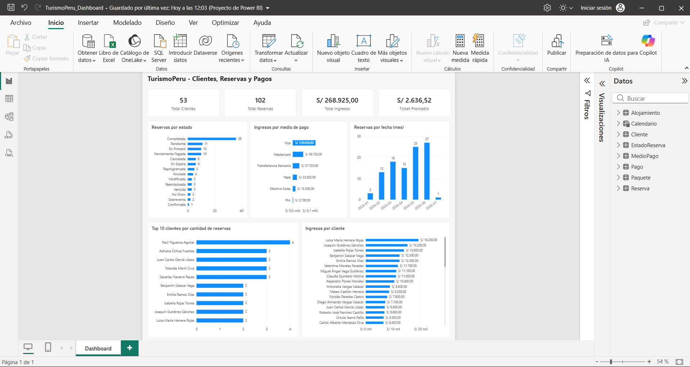
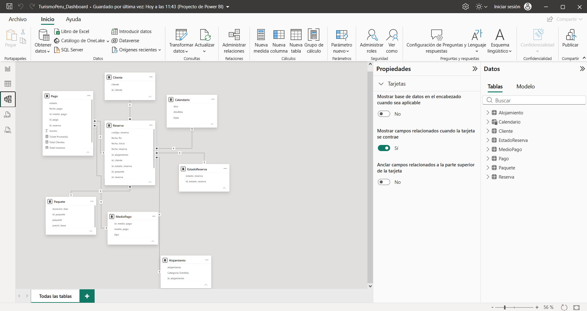

# Reporte en Power BI



## Fuente de datos
- SQL Server, base `TurismoPeru_ADJG`, esquema `ADJG`, modo Importar.
- Conexión con el usuario `ADJG_analista`, que solo tiene permisos de lectura. Así el reporte no puede modificar datos.
- El servidor y la base están como parámetros (`Servidor` y `BaseDatos`). La contraseña no se guarda en el reporte,
  Power BI la pide al actualizar.
- De `persona` solo se leen `id_persona`, `nombres`, `apaterno` y `amaterno`, que son las columnas permitidas al analista.

## Modelo


```
Cliente 1 ── * Reserva 1 ── * Pago
                 │                │
EstadoReserva 1 ─┤                └─ * 1 MedioPago
Paquete 1 ───────┤
Alojamiento 1 ───┤
Calendario 1 ────┘ (fecha_reserva)
```

| Tabla | Origen |
|---|---|
| Cliente | `cliente` + nombres de `persona` |
| Reserva | `reserva` |
| Pago | `pago` |
| EstadoReserva | `estado_reserva` |
| MedioPago | `medio_pago` |
| Paquete | `paquete` |
| Alojamiento | `alojamiento` |
| Calendario | Tabla DAX (2026) |

Todas las relaciones son de uno a varios con filtro en una sola dirección.

## Medidas
```DAX
Total Reservas = COUNTROWS ( Reserva )
Total Ingresos = CALCULATE ( SUM ( Pago[monto] ), Pago[estado] = "Confirmado" )
Total Clientes = COUNTROWS ( Cliente )
Ticket Promedio = DIVIDE ( [Total Ingresos], [Total Reservas] )
```

Los ingresos toman solo pagos `Confirmado`. Los pagos anulados, pendientes o rechazados no son dinero recibido.

Medida oculta para el Top 10 de clientes. Muchos clientes empatan con 2 reservas y el filtro N superior de Power BI
muestra a todos los empatados, así que el empate se resuelve por ingresos:
```DAX
Puntaje Top Clientes = [Total Reservas] + DIVIDE ( [Total Ingresos], 10000000 )
```

## Visualizaciones
| Visual | Tipo | Campos |
|---|---|---|
| KPI | Tarjetas | Total Clientes, Total Reservas, Total Ingresos, Ticket Promedio |
| Reservas por estado | Barras | `EstadoReserva[estado_reserva]`, Total Reservas |
| Ingresos por medio de pago | Anillo | `MedioPago[medio_pago]`, Total Ingresos |
| Reservas por fecha | Columnas | `Calendario[AñoMes]`, Total Reservas |
| Top 10 clientes | Barras con filtro N superior = 10 por Puntaje Top Clientes | `Cliente[cliente]`, Total Reservas |
| Ingresos por cliente | Barras | `Cliente[cliente]`, Total Ingresos |

La interpretación de cada gráfico está en [05_reportes/README.md](../05_reportes/README.md).

## Principales resultados
| Total Clientes | Total Reservas | Total Ingresos | Ticket Promedio |
|---|---|---|---|
| 53 | 102 | S/ 268,925.00 | S/ 2,636.52 |

## Conclusiones
1. Se observa que solo el 35.3 % de las reservas (36 de 102) está completada, mientras que 37 siguen abiertas
   (Pendiente, En Proceso, Parcialmente Pagada o En Espera) y 18 no llegaron a darse (Cancelada, Anulada,
   Reembolsada, Vencida o No Show).
2. El medio de pago con mayor ingreso es Visa, con S/ 129,650 (48.2 %). Junto con Mastercard, las tarjetas suman
   el 70.4 % de lo cobrado; Yape y Plin llegan al 9.9 % y el efectivo al 5.7 %.
3. El periodo con más reservas es mayo-junio de 2026, con 25 y 27 reservas: el 51 % del total en solo dos meses.
   Enero tuvo apenas 3.
4. Los 10 clientes que más pagan concentran el 46.8 % de los ingresos (S/ 125,900 de S/ 268,925) entre 45 clientes
   con pagos confirmados. Luisa María Herrera Rojas encabeza con S/ 19,200.
5. Tener más reservas no significa generar más ingresos: Raúl Figueroa Aguilar es el cliente con más reservas (4)
   pero solo tiene S/ 625 confirmados, muy por debajo del ticket promedio de S/ 2,636.52.
6. De S/ 412,640 reservados solo se ha cobrado el 65.2 %. Hay 23 pagos sin confirmar (10 anulados, 10 pendientes y
   3 rechazados) por S/ 84,650.50, y 5 devoluciones registradas como pagos negativos por S/ 19,850.

## Cómo abrir el reporte
El proyecto de Power BI (.pbip) se guarda fuera del repositorio porque contiene la dirección del servidor.
Para recrearlo se conecta Power BI a SQL Server con `ADJG_analista`, se cargan las tablas de la sección Modelo
(las consultas equivalentes están en `05_reportes/consultas_reportes.sql`) y se crean las relaciones y medidas
de este documento.
